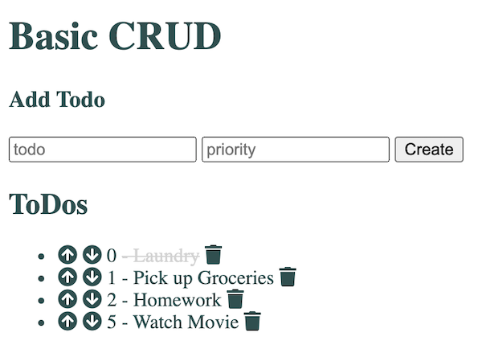

# basic-crud
A live basic CRUD app.
Check it out: [https://one-basic-crud.herokuapp.com/](https://one-basic-crud.herokuapp.com/)

### Set up
Add .env file in root containing:

    DB_STRING = <database connection string>
    DB_NAME = <database name>

#### Improvements

- Add styling
- reorder priority buttons
- update increment api